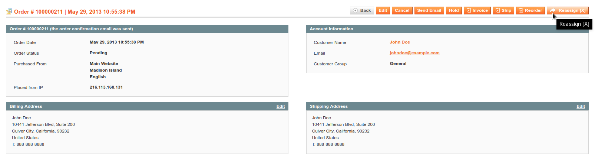
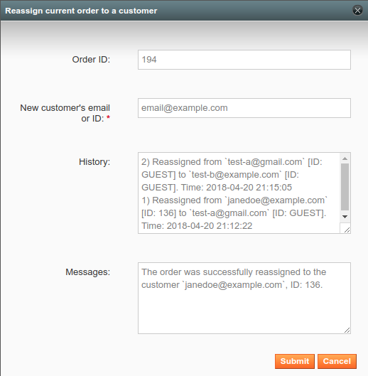
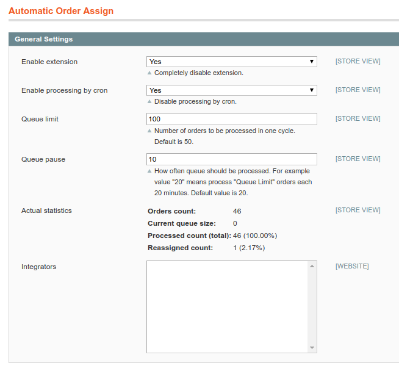

Optimlight_OrderAutoAssign
==========================

 **Bring all customers' orders together.**  

When `Guest Checkout` is (or was) enabled in Magento store, there is a common problem of having placed both guest and authorized orders from the same customers (emails).
Current extension deals with such problem in two ways:
- by performing a search with the automatic reassignment of such orders,
- by allowing to reassign order from a guest or registered customer to another guest's email or another registered customer within `Admin Panel`.

So once the customer has made an account in the store -- all his previous orders made as a guest will be attached to his account alongside with new guest orders for the same email address.

Log history of such reassignments is stored for each order and can be reviewed later.

## Details
- Cron job during which module checks and reassigns guest orders to a corresponded registered customers if the email from guest order matches with the email of registered customer's account. 
- Processing is balanced, so the extension can handle any number of orders in DB.

  Once an order is checked -- it will be rechecked after the specified time.  
  
  Delay and the number of orders to be processed in bulk can be configured in the `Admin Panel`.
- New `"Reassign"` button in the `Admin Panel > View Order`. An order can be reassigned either to a guest by email or to a registered customer by email or customer's ID.

- In case of any error occurred during reassignment process -- the corresponded message with error's description is shown and made DB changes are rolled back.
- Each order has its track of reassignments with information about "from", "to whom" and "when" order was reassigned.     
- Possibility to add support for other modules which are impacted by reassignment (mapping rules are defined in `config.xml` and can be merged).
  
  In case to extend the logic of reassignments more flexibly either can be created class which extends `Optimlight_AutoOrderAssign_Model_Integrator_Abstractum` or can be used next events:
  - `opt_aoa_order_assign_before`
  - `opt_aoa_order_assign_after`
  - `opt_aoa_order_check_after`   
- Current statistics of reassignment process can be reviewed in the `Admin Panel`. 
- Multi-store is supported.

## Screenshots

**Manual reassignments.**

**Settings and statistics.**

## License

The MIT License (MIT)